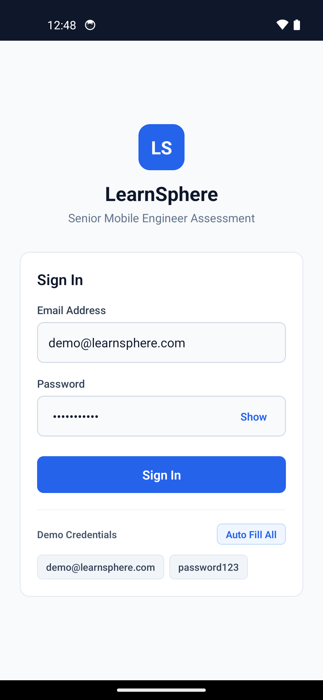

# LearnSphere — Senior React Native Learning Dashboard

LearnSphere is a clean, scalable mobile application built with **React Native CLI + TypeScript** for iOS and Android. It demonstrates production-ready mobile engineering fundamentals using **functional components exclusively**, custom React Hooks (`useState`, `useEffect`, `useCallback`, `useMemo`), repository pattern, real-time device network caching with `NetInfo` and `AsyncStorage`, and unit testing with `Jest`. Package management is configured for **Yarn**.

---

## 📦 Submission Deliverables

| Deliverable                    | Direct Download / Repository Link                                                                                                          |
| :----------------------------- | :----------------------------------------------------------------------------------------------------------------------------------------- |
| **1. Git Repository**          | [https://github.com/chaithanya-git-it/LearnSphereApp](https://github.com/chaithanya-git-it/LearnSphereApp)                                 |
| **2. Android Build (APK Zip)** | ⬇️ **[Download LearnSphere-debug.apk.zip](https://github.com/chaithanya-git-it/LearnSphereApp/raw/main/builds/LearnSphere-debug.apk.zip)** |
| **3. Demo Video (MOV)**        | 🎬 **[Download demo.mov](https://github.com/chaithanya-git-it/LearnSphereApp/raw/main/demo/demo.mov)**                                     |
| **4. Demo Video (MP4)**        | 🎬 **[Download demo.mp4](https://github.com/chaithanya-git-it/LearnSphereApp/raw/main/demo/demo.mp4)**                                     |
| **5. Technical README**        | Documented below with full architectural & scaling analysis.                                                                               |

### Video Demonstration Highlights (`demo/demo.mov` / `demo/demo.mp4`)

1. **Login Screen**: Dynamic field validation on keypress, Show/Hide password eye toggle, password length cap (11 chars), and autofill chips.
2. **Course List Dashboard**: Progress bars, lesson counter, pull-to-refresh, empty/error state handling.
3. **Course Details**: Interactive module breakdown.
4. **Lesson Completion**: Real-time lesson completion toggles with live course progress calculation (`Math.round((completed / total) * 100)`).
5. **Offline Behaviour**: `@react-native-community/netinfo` connectivity listener with `AsyncStorage` fallback and red alert banner.

---

## Application Screenshot

<p align="center">
  
</p>

---

## 1. Project Overview & Features

- **App Name**: LearnSphere
- **Android App Label / iOS Display Name**: `LearnSphere`
- **Bundle Identifier**: `com.learnsphere.mobile`
- **Functional Component Architecture**: 100% functional components with React Hooks (`useState`, `useEffect`, `useCallback`, `useMemo`). Zero class components.
- **Yarn Package Manager**: All dependency management and scripts configured via Yarn (`yarn add`, `yarn test`, `yarn lint`, `yarn android`, `yarn ios`).
- **Authentication & Instant Validation**: Login screen featuring real-time email/password input validation, password eye toggle (`Show` / `Hide`), password max length restriction (`maxLength={11}`), and interactive autofill chips (`demo@learnsphere.com`, `password123`).
- **Course Dashboard**: Dynamic course list displaying title, instructor, progress bar, lesson count, pull-to-refresh, loading states, empty state, and error handling with retry functionality.
- **Interactive Course Details**: Module breakdown with real-time lesson completion toggles, automatic progress recalculation (`Math.round((completed / total) * 100)`), single source of truth sync with dashboard card, and persistent local storage.
- **Real-Time NetInfo Offline Mode**: Listens to device network changes via `@react-native-community/netinfo`. Automatically falls back to local `AsyncStorage` when offline, displaying a prominent red offline banner.

---

## 2. Architecture & Design Rationale

LearnSphere uses a unidirectional, functional layered architecture:

```
[ Functional UI Screens & Reusable Components ]
                       ↓
         [ Custom Hooks ] (useCourses)
                       ↓
     [ Functional CourseRepository Module ]
              ↙              ↘
[ Remote CourseApi Client ]   [ StorageService Module ]
 (Fetch API & NetInfo)          (AsyncStorage Cache)
```

### Why This Architecture Was Chosen

1. **Functional-First Design**: Pure functional components with React Hooks keep UI components lightweight and presentational. Services and repositories are exported as functional modules.
2. **Separation of Concerns**: Custom hooks manage UI state and side effects, while `CourseRepository` abstracts data origin.
3. **Offline-First & Testable**: Placing data retrieval behind a repository interface isolates network fetching from caching logic, making it easy to swap simulated remote data with real REST/GraphQL APIs.
4. **Yarn Management**: Preserves project lockfile integrity and leverages Yarn scripts.

---

## 3. Demo Credentials

- **Email**: `demo@learnsphere.com`
- **Password**: `password123`

---

## 4. Setup & Running Instructions (Yarn)

### Prerequisites

- Node.js >= 18
- Yarn package manager
- JDK 17 & Android Studio (for Android)
- Xcode & CocoaPods (for iOS macOS)

### Installation

```bash
# Navigate to the project root
cd LearnSphereApp

# Install dependencies using Yarn
yarn install
```

### iOS Setup (macOS only)

```bash
cd ios && pod install && cd ..
yarn ios
```

### Android Setup

```bash
yarn android
```

---

## 5. Offline Caching & Real-Time NetInfo

- **Implementation**: `StorageService` wraps `@react-native-async-storage/async-storage` (`@learnsphere_courses_v1`). Real-time device connectivity is monitored via `@react-native-community/netinfo`.
- **Automatic Fallback**: On network failure or device offline state, `CourseRepository` seamlessly loads cached courses and displays a high-contrast red offline banner.

---

## 6. Production Token & Credentials Storage

- **Android**: Use Android Keystore-backed encrypted storage (`EncryptedSharedPreferences`) via `react-native-encrypted-storage` or `react-native-keychain`.
- **iOS**: Use iOS Keychain Services via `react-native-keychain` or `react-native-encrypted-storage`.

---

## 7. Scaling Strategy (1M+ Users & 100s of Courses)

1. **Pagination & Infinite Scroll**: Cursor-based pagination in `CourseApi` (`/api/courses?cursor=xyz&limit=20`) with `FlatList` windowing optimization.
2. **Local Database (SQLite / WatermelonDB / Realm)**: Replace key-value `AsyncStorage` with an indexed relational database for fast queries on hundreds of offline courses and lessons.
3. **State Normalization & CDN Caching**: Store entities in normalized form (`coursesById`, `lessonsById`). Serve static assets via CDN edge caches with ETag headers.
4. **WebSockets / Push Notifications**: Real-time progress updates across devices.

---

## 8. Native Implementation Comparison

### Android (Kotlin + Jetpack Compose)

- **Architecture**: Clean Architecture + MVVM + Repository pattern.
- **UI**: Jetpack Compose (`LazyColumn`, `Card`, `LinearProgressIndicator`).
- **State & Concurrency**: Kotlin Coroutines & `StateFlow` collected via `collectAsStateWithLifecycle()`.
- **Storage & Networking**: Room Database with DAO interfaces and Retrofit / OkHttp client.
- **DI**: Hilt (`@HiltViewModel`, `@Inject`).

### iOS (Swift + SwiftUI)

- **Architecture**: MVVM + Repository pattern.
- **UI**: SwiftUI (`List`, `VStack`, `ProgressView`, `@Binding`).
- **State & Concurrency**: Swift Concurrency (`async/await`, `@Observable` or `ObservableObject`).
- **Storage & Networking**: SwiftData or CoreData for persistent storage, `URLSession` for network requests.
- **DI**: Protocol-based injection or Factory pattern.

---

## 9. Running Unit Tests & Quality Verification

```bash
# Run Jest unit tests via Yarn
yarn test

# Run TypeScript type check via Yarn
yarn lint
```

---

## 10. Known Limitations & Assumptions

1. **Mock Authentication**: Auth token is simulated locally; no real OAuth or JWT validation server is contacted.
2. **Mock Data Scope**: Pre-seeded with 3 courses of 4 lessons each for evaluation purposes.
3. **Single Device Storage**: Offline data is scoped to local `AsyncStorage`.
